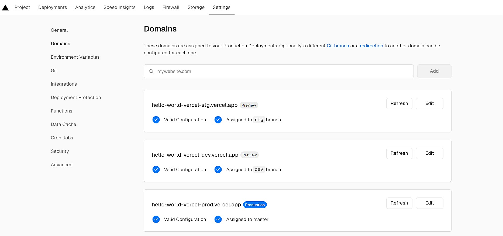
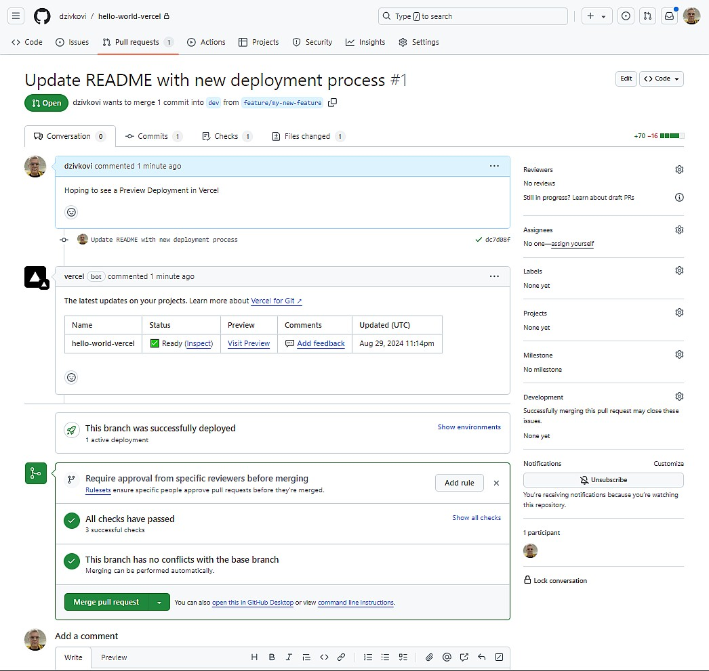
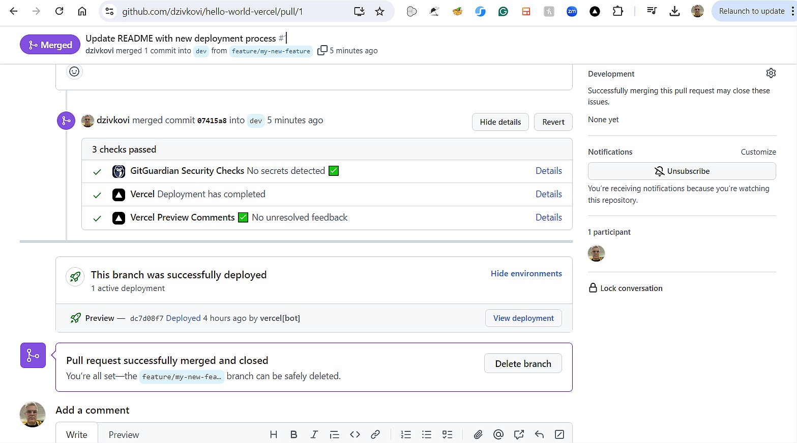
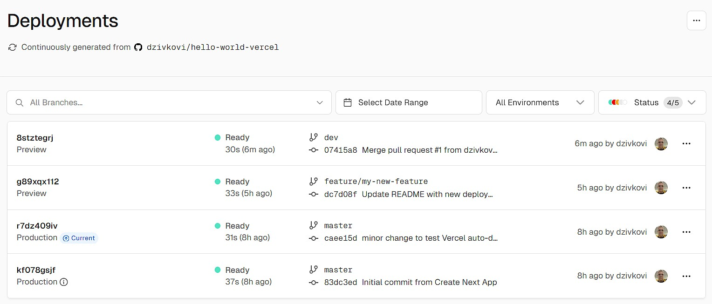

# Hello World Vercel

This is a minimal Next.js project set up with Vercel for automated CI/CD.

## Local Development

1. Clone the repository:

    ```sh
    git clone https://github.com/dzivkovi/hello-world-vercel.git
    cd hello-world-vercel
   ```

2. Install dependencies:

   ```sh
   npm install
   ```

3. Run the development server:

   ```sh
   npm run dev
   ```

4. Open [http://localhost:3000](http://localhost:3000) in your browser to see the result.

## Vercel Deployments

Every push to any branch, and every Pull Request, triggers a preview deployment in Vercel. This allows you to visualize and test your changes in a live environment before merging them into `dev` or `master`.

### Deployment Environments

- Production: [https://hello-world-vercel-prod.vercel.app](https://hello-world-vercel-prod.vercel.app)
- Development: [https://hello-world-vercel-dev.vercel.app](https://hello-world-vercel-dev.vercel.app)
- Staging: [https://hello-world-vercel-stg.vercel.app](https://hello-world-vercel-stg.vercel.app) (if applicable)
- Preview: Automatically generated for each Pull Request (PR)

#### Creating Domains for Deployment Environments

1. Go to [https://vercel.com/dashboard](https://vercel.com/dashboard) and sign in
2. Select your "hello-world-vercel" project
3. Go to "Settings" > "Domains"
4. Add each domain and assign it to the appropriate branch (e.g. `dev`, `stg`, `master`).



### Branching Strategy

- `master`: Production branch. Deploys to the production environment.
- `dev`: Development branch. Deploys to the development environment.
- All other branches (including `feature/*`, `bugfix/*`, `hotfix*`, `release-*`, etc.):
  - Automatically get preview deployments for every push.
  - These preview deployments allow you to see and test changes before merging.

## Deployment Process

This project uses Vercel for automated deployments:

- Create a Pull Request: Generates a preview deployment
- Push to `dev` branch: Triggers a deployment to the development environment
- Push to `master` branch: Triggers a production deployment

### Development Workflow

1. Create a new branch from `dev`:

   ```sh
   git checkout dev
   git pull
   git checkout -b feature/your-feature-name
   ```

2. Make your changes and commit:

   ```sh
   git add .
   git commit -m "Description of your changes"
   ```

3. Push your branch:

   ```sh
   git push -u origin feature/your-feature-name
   ```

4. Go to the GitHub repository and create a Pull Request to merge into `dev`.
5. Vercel will automatically create a preview deployment for your PR:
    
6. After review and approval, merge the PR into `dev`:
    
7. Vercel will automatically deploy the changes to the development environment:
    
8. And you'll be able to see the changes in the development Domain [https://hello-world-vercel-dev.vercel.app](https://hello-world-vercel-dev.vercel.app)

The same process applies when moving upstream into `master` for production (or `stg` for staging) deployments.

## Learn More

- Vercel's Next.js [`hello-world` template](https://github.com/vercel/next.js/tree/canary/examples/hello-world) used to generated the app behind this repo.
- Short [Vercel Product Walkthrough](https://www.youtube.com/watch?v=sPmat30SE4k) video.
- [Vercel Documentation](https://vercel.com/docs)
